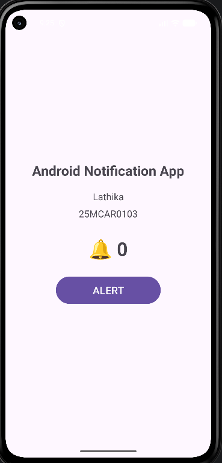
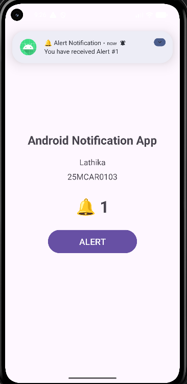
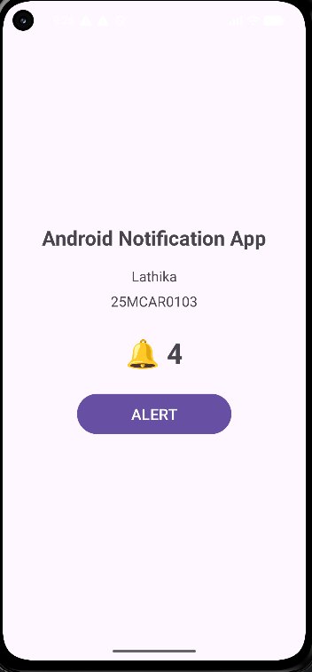

# Android Notification Alert App


## Experiment


**Experiment Title:** Develop an application for displaying notifications in Android.


## 1. Aim


To develop an Android application that displays notifications when the user presses an **ALERT** button. The application also maintains and displays the number of alerts generated and plays a notification sound.


## 2. Concept / Technology Used


This experiment demonstrates the Android **Notification Framework** using Kotlin.


### Technologies Used


- **Android Studio** – Development environment

- **Kotlin** – Application programming language

- **XML** – User interface design

- **Android NotificationChannel** – Creates and manages notification channels on Android 8.0+

- **NotificationCompat.Builder** – Builds notifications in a backward-compatible way

- **NotificationManagerCompat** – Displays notifications

- **POST_NOTIFICATIONS permission** – Required for notifications on Android 13+

- **RingtoneManager** – Provides the default notification sound


### Notification Concept


When the user clicks the **ALERT** button:


1. The alert counter is increased by one.

2. The number of alerts is displayed beside a bell symbol.

3. An Android notification is created.

4. The notification contains an alert title and message.

5. A notification sound is played.

6. Each notification receives a unique notification ID based on the alert count.


A notification channel with high importance is created so that alerts can be displayed prominently with sound.


## 3. Scenario Used


The application represents a simple **alert/notification system**.


For example, a user may need to receive repeated alerts from an application. Every time an alert occurs, the application:


- Displays the alert count.

- Shows a bell symbol.

- Generates an Android notification.

- Plays a notification sound.


The application also displays the student's **Name and USN** on the screen for experiment identification.


## 4. Application Features


- Simple and user-friendly interface

- Student name and USN displayed

- ALERT button

- Bell symbol showing the number of alerts

- Android notification generation

- Notification sound

- Notification title and message

- Notification count

- Notification permission handling for Android 13+

- Notification channel support for Android 8.0+


## 5. Project Folder and File Structure


```text

Android-Notification-Alert-App/

│

├── app/

│   ├── src/

│   │   ├── main/

│   │   │   ├── java/

│   │   │   │   └── com/

│   │   │   │       └── example/

│   │   │   │           └── exp5/

│   │   │   │               └── MainActivity.kt

│   │   │   │

│   │   │   ├── res/

│   │   │   │   ├── layout/

│   │   │   │   │   └── activity_main.xml

│   │   │   │   │

│   │   │   │   ├── values/

│   │   │   │   │   ├── strings.xml

│   │   │   │   │   ├── colors.xml

│   │   │   │   │   └── themes.xml

│   │   │   │   │

│   │   │   │   └── drawable/

│   │   │   │

│   │   │   └── AndroidManifest.xml

│   │   │

│   │   ├── androidTest/

│   │   └── test/

│   │

│   └── build.gradle.kts

│

├── gradle/

│

├── Screenshot/

│   ├── output1.png

│   ├── output2.png

│   └── output3.png

│

├── build.gradle.kts

├── settings.gradle.kts

├── gradle.properties

├── gradlew

├── gradlew.bat

└── README.md

```


## 6. Important Files


### MainActivity.kt


`MainActivity.kt` contains the main application logic. It:


- Creates the notification channel.

- Requests notification permission when required.

- Detects clicks on the ALERT button.

- Increases the alert count.

- Updates the alert count displayed on the screen.

- Creates and displays the notification.

- Plays the notification sound.


### activity_main.xml


`activity_main.xml` defines the user interface. It contains:


- Application title

- Student name

- Student USN

- Bell symbol and alert count

- ALERT button


### AndroidManifest.xml


The manifest declares the application and launcher activity and includes the notification permission:


```xml

<uses-permission android:name="android.permission.POST_NOTIFICATIONS" />

```


## 7. Test Cases


### Test Case 1 – Initial Alert / Student Identification


**Test Objective:** Verify that the application displays the student's name, USN, initial alert count, and ALERT button.


**Steps:**

1. Launch the application.

2. Verify the application title.

3. Verify the student's name and USN.

4. Verify that the alert count initially displays `🔔 0`.

5. Verify that the ALERT button is visible.


**Expected Result:**

The application opens successfully and displays the student's name, USN, bell symbol with count `0`, and the ALERT button.


**Screenshot:**





> **Important:** Make sure `output1.png` clearly shows your actual name and USN before submission.


---


### Test Case 2 – Generate First Alert


**Test Objective:** Verify that pressing the ALERT button generates a notification and updates the alert count.


**Steps:**

1. Open the application.

2. Press the **ALERT** button once.

3. Observe the alert count.

4. Check the Android notification area.

5. Verify the notification sound.


**Expected Result:**

The alert count changes from `🔔 0` to `🔔 1`, and an Android notification is displayed with an alert sound.


**Screenshot:**





---


### Test Case 3 – Generate Multiple Alerts


**Test Objective:** Verify that multiple ALERT button presses increase the notification count correctly.


**Steps:**

1. Press the **ALERT** button multiple times.

2. Observe the bell count after each click.

3. Check the notification area.

4. Verify that notifications are generated with sound.


**Expected Result:**

The alert count increases sequentially, for example:


`🔔 1 → 🔔 2 → 🔔 3`


A notification is generated for each alert.


**Screenshot:**





## 8. Expected Output


The application initially displays:


```text

Android Notification App


Name: Lathika

USN: YOUR_USN


🔔 0


[ 🔔 ALERT ]

```


After pressing the ALERT button:


```text

🔔 1

```


An Android notification is also displayed with a notification sound.


After additional clicks:


```text

🔔 2

🔔 3

...

```


## 9. Output Screenshots


### Output 1


### Output 2


### Output 3


## 10. Result


The Android notification application was successfully developed using **Kotlin and XML**. The application displays notifications when the ALERT button is pressed, maintains the number of alerts using a bell symbol, and produces a notification sound. The experiment demonstrates the basic implementation of Android notifications, notification channels, permissions, and user interaction.


## 11. Conclusion


This experiment provides practical knowledge of Android's notification system. It demonstrates how to create notification channels, request notification permission, build notifications, display notification counts, and provide notification sounds in an Android application.
